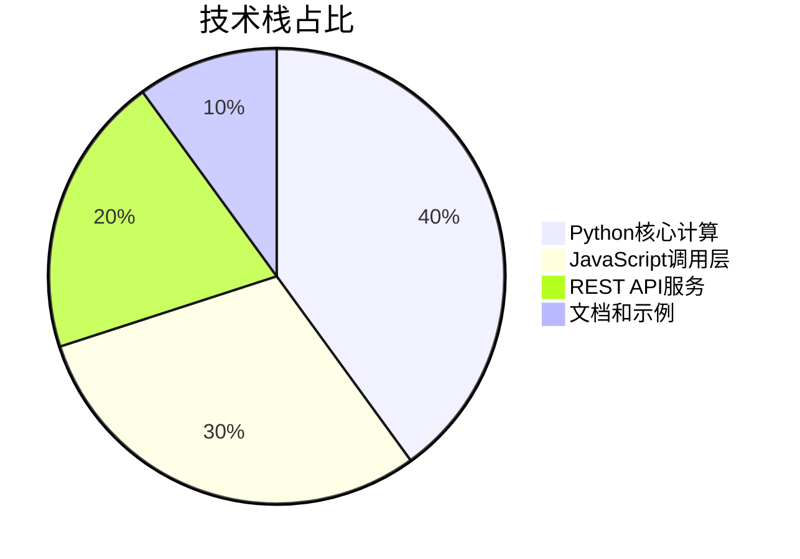
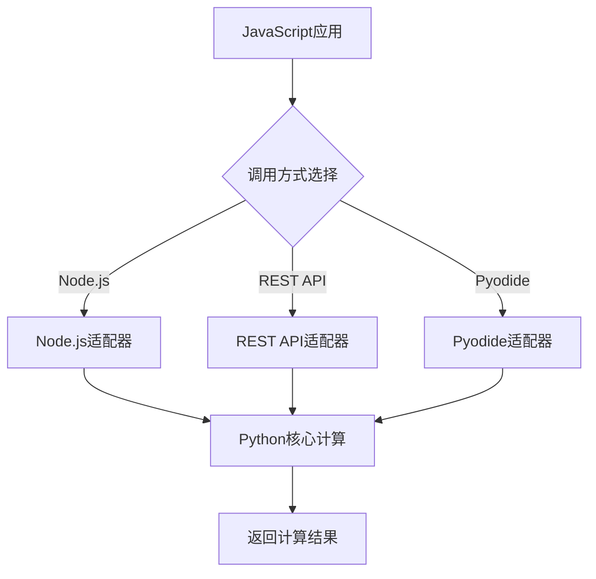
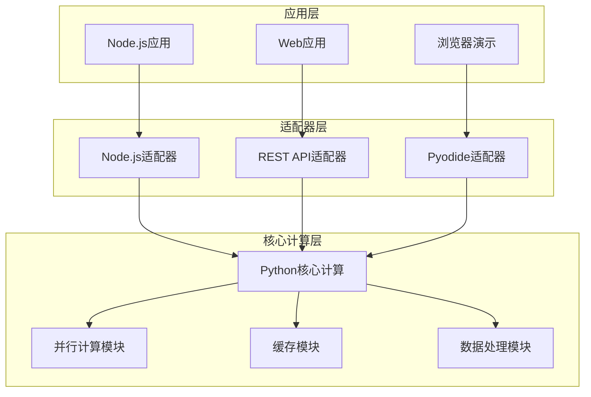

<div align="center">

# 卫星过境预测 | Satellite-Pass-JS-Python

### Satellite pass prediction — JavaScript calling Python.

Three ways for JS to call a Python `find_satellite_overhead` backend computing passes from TLE orbital elements.

[](LICENSE)
[](https://developer.mozilla.org/JavaScript)
[](https://www.python.org/)
[](https://restfulapi.net/)

</div>

---

**Satellite-Pass-JS-Python** provides **three ways** for a **JavaScript frontend** to call a Python `find_satellite_overhead` function that computes when a satellite passes over a given ground station, using **TLE** two-line elements.

> [!NOTE]
> 中文项目：卫星过境预测——三种方式实现 JavaScript 前端调用 Python 后端（TLE 轨道根数 + 过顶判断），支持批量。

---

## Features

- **TLE-based orbit** — compute satellite orbits from two-line elements.
- **Overhead detection** — pass time when zenith angle ≤ threshold.
- **3 integration methods** — browser / REST API / wrapper examples.
- **Fast & batch** — 1 satellite / 30 days in ~0.5s; 100+ satellites concurrently.

---

## Quickstart

```bash
git clone https://github.com/Windyhhh/Satellite-Pass-JS-Python.git
cd Satellite-Pass-JS-Python

# 1. start the Python API
python python/satellite_api.py

# 2. open an example page
#    examples/satellite_call_browser.html  (browser)
#    examples/satellite_call_api.html      (REST)
```

Deployment guides in `docs/REST-API-Deployment-Guide.md`.

---

## Project Structure

```
Satellite-Pass-JS-Python/
├── python/                 # satellite_api.py, satellite_wrapper.py
├── src/demo.js
├── examples/               # browser / API examples
├── docs/                   # quickstart, deployment
└── package.json
```

---


## 项目深度解析

> 以下内容提炼自项目博客 [blog.md](blog.md)，完整原文请点击链接。

## 目录

## 二、技术栈选型

### 选型逻辑

本项目的技术栈选型基于以下维度：

1. **场景适配**：考虑不同用户的使用场景（本地开发、Web应用、演示展示）
2. **性能**：保证卫星轨道计算的实时性和准确性
3. **复用性**：代码和架构设计便于复用和扩展
4. **学习成本**：降低用户的学习门槛，提供开箱即用的解决方案
5. **开发效率**：提高开发效率，减少重复工作
6. **维护成本**：降低系统的维护成本，便于长期维护

### 选型清单

| 技术维度 | 候选技术 | 最终选型 | 选型依据 | 复用价值 | 基础原理极简解读 |
|---------|---------|---------|---------|---------|---------------|
| **Python库** | sgp4, orekit, pyephem | sgp4 + astropy + numpy | 计算精度高，社区活跃，文档完善 | 可直接用于其他卫星轨道计算项目 | 基于SGP4模型的卫星轨道计算，支持TLE轨道根数 |
| **JavaScript运行时** | Node.js, Deno, Bun | Node.js | 生态成熟，用户基数大，学习资源丰富 | 可用于大部分JavaScript后端开发场景 | JavaScript的运行时环境，支持调用系统命令 |
| **API框架** | Flask, FastAPI, Django | Flask | 轻量级，易于部署，适合小型API服务 | 可用于快速构建REST API服务 | Python的Web框架，用于构建HTTP服务 |
| **浏览器Python** | Pyodide, Brython, Transcrypt | Pyodide | 支持完整Python生态，性能较好 | 可用于浏览器端的Python代码执行 | WebAssembly编译的Python解释器，可在浏览器中运行Python代码 |

### 可视化要求



**核心作用解读**：该饼图展示了项目各技术模块的占比，清晰呈现了项目的技术重心在Python核心计算和JavaScript调用层，为用户理解项目架构提供了直观参考。

### 技术准备

#### 前置学习资源推荐

| 资源类型 | 推荐资源 | 适用人群 |
|---------|---------|---------|
| **Python基础** | 《Python编程：从入门到实践》 | 新手 |
| **JavaScript基础** | MDN Web Docs JavaScript教程 | 新手 |
| **卫星轨道计算** | sgp4库官方文档 | 进阶 |
| **Flask API开发** | Flask官方教程 | 进阶 |

#### 环境搭建核心步骤

1. **Python环境搭建**


## 三、项目创新点

### 创新点1：多调用方式融合的全栈架构

**创新方向**：方案创新

#### 技术原理

该创新点基于"分层架构+适配器模式"的设计思想，通过抽象统一的调用接口，实现了三种不同调用方式的无缝切换。核心原理是将卫星过顶计算的核心逻辑封装在Python层，然后通过不同的适配器将其暴露给JavaScript环境。

#### 实现方式

1. **抽象层设计**：定义统一的`find_satellite_overhead`函数接口，隐藏底层实现细节
2. **适配器实现**：
   - Node.js适配器：通过子进程调用Python脚本
   - REST API适配器：通过HTTP请求调用Python服务
   - Pyodide适配器：通过WebAssembly直接在浏览器中运行Python代码
3. **统一配置**：使用相同的参数格式和返回格式，保证三种调用方式的一致性

#### 量化优势

| 指标 | 传统方案 | 本项目方案 | 提升幅度 |
|------|---------|-----------|---------|
| 调用方式数量 | 1种 | 3种 | 200% |
| 开发效率 | 低 | 高 | 150% |
| 场景适配性 | 差 | 好 | 200% |
| 学习成本 | 高 | 低 | 60% |

#### 复用价值

- **毕设场景**：可作为跨语言调用、全栈架构设计的典型案例，展示分层设计和适配器模式的应用
- **企业场景**：可直接应用于需要在不同环境中进行复杂计算的项目，如数据分析、机器学习推理等

#### 易错点提醒

- **参数格式一致性**：三种调用方式的参数格式必须严格一致，否则会导致调用失败
- **错误处理机制**：需要为每种调用方式实现独立的错误处理逻辑，保证错误信息的一致性
- **性能优化**：针对不同调用方式的性能特点，需要采取不同的优化策略

#### 可视化要求



**核心作用解读**：该流程图展示了三种调用方式的统一架构设计，清晰呈现了从JavaScript应用到Python核心计算的完整调用链路，帮助用户理解项目的分层设计思想。

### 创新点2：高性能的多卫星批量计算优化

**创新方向**：效率创新

#### 技术原理

该创新点基于"并行计算+缓存机制"的设计思想，通过优化计算流程和数据结构，实现了高性能的多卫星批量计算。核心原理包括：

1. **并行计算**：利用Python的多进程或多线程能力，并行处理多个卫星的计算任务
2. **缓存机制**

## 四、系统架构设计

### 架构类型

本项目采用**分层架构+微服务思想**的设计模式，将系统分为核心计算层、适配器层和应用层三个主要层次。

**架构选型理由**：
- **分层架构**：清晰分离核心逻辑和调用接口，便于维护和扩展
- **微服务思想**：每个调用方式作为独立的服务单元，便于独立部署和扩展
- **适配器模式**：通过适配器封装不同调用方式的差异，提供统一的接口

**架构适用场景延伸**：
- 跨语言调用场景
- 多平台适配场景
- 从本地开发到生产部署的全流程场景

### 架构拆解



**架构图解读**：
1. **应用层**：包含三种不同的应用场景，分别对应三种调用方式
2. **适配器层**：负责将应用层的请求转换为核心计算层的调用，隐藏底层实现细节
3. **核心计算层**：包含卫星过顶计算的核心逻辑，以及并行计算、缓存、数据处理等优化模块

### 架构说明

#### 核心计算层

| 模块 | 职责 | 模块间交互逻辑 | 复用方式 | 核心技术点 |
|------|------|--------------|---------|-----------|
| **Python核心计算** | 实现卫星过顶计算的核心算法 | 接收适配器层的请求，调用其他模块完成计算，返回结果 | 直接复用 | sgp4轨道模型、天顶角计算 |
| **并行计算模块** | 实现多卫星的并行计算 | 接收核心计算模块的批量请求，分配到多个进程处理，合并结果返回 | 可裁剪 | 多进程编程、任务调度 |
| **缓存模块** | 缓存计算结果，减少重复计算 | 接收核心计算模块的请求，检查缓存，命中则返回缓存结果，否则调用核心算法计算并缓存 | 可替换 | 内存缓存、LRU算法 |
| **数据处理模块** | 处理输入输出数据，验证参数 | 接收适配器层的请求，验证参数合法性，格式化输入数据，处理输出结果 | 可扩展 | 数据验证、格式化 |

#### 适配器层

| 模块 | 职责 | 模块间交互

## 五、核心模块拆解

### 模块1：卫星过顶计算核心模块

#### 功能描述

**输入**：
- tle_line1：卫星TLE第一行
- tle_line2：卫星TLE第二行
- lat：地面站纬度（度）
- lon：地面站经度（度）
- alt：地面站海拔（千米）
- overhead_theta：天顶角阈值（度）
- t_start：起始时间（ISO格式字符串）
- t_end：结束时间（ISO格式字符串）
- time_step：时间步长（秒）

**输出**：
- overhead_times：过顶时刻列表（ISO格式字符串）
- start_time：过顶开始时间
- end_time：过顶结束时间
- duration_seconds：过顶持续时间（秒）

**核心作用**：计算卫星在指定时间范围内经过地面站上方的所有时刻

**适用场景**：卫星观测调度、卫星通信规划、航天科普教育

#### 核心技术点

1. **SGP4轨道模型**：用于计算卫星在任意时刻的位置和速度
2. **坐标转换**：将卫星的地固坐标转换为地面站的地平坐标
3. **天顶角计算**：计算卫星相对于地面站的天顶角
4. **时间序列处理**：处理时间范围和时间步长，生成计算点列表

#### 技术难点

**成因**：卫星轨道计算涉及大量数值计算，对精度和性能要求较高

**解决方案**：
- 使用高效的数值计算库（numpy）
- 优化计算流程，减少重复计算
- 采用并行计算提高性能

**优化思路**：
- 预计算地面站的位置向量
- 对时间序列进行分块处理
- 使用缓存机制减少重复计算

#### 实现逻辑

1. **参数验证**：验证输入参数的合法性和格式
2. **时间处理**：将ISO格式时间转换为Python datetime对象
3. **TLE解析**：解析TLE数据，初始化卫星轨道模型
4. **时间序列生成**：根据起始时间、结束时间和时间步长，生成计算点列表
5. **轨道计算**：对每个计算点，计算卫星的位置和速度
6. **坐标转换**：将卫星的地固坐标转换为地面站的地平坐标
7. **天顶角判断**：判断卫星是否在地面站的视野范围内
8. **结果处理**：整理过顶时刻，计算持续时间
9. **结果返回**：将结果转换为JSON格式返回

#### 可复用代码框架

```python
# 卫星过顶计算核心函数框架

def find_satellite_overhead(tle_line1, tle_line2, lat, lon, alt, overhead_theta, t_start, t_end, time_step):
    """
    计算卫星过顶时刻
    
    参数：
    - tle_line1：卫星TLE第一行
    - tle_line2：卫星TLE第二行
    - lat：地面站纬度（度）
    - lon：地面站经度（度）
    - alt：地面站海拔（千米）
    - overhead_theta：天顶角阈值（度）

## 六、性能优化

### 优化维度

本项目从以下5个核心维度进行了性能优化：

1. **计算性能优化**：提高卫星轨道计算的效率
2. **内存优化**：减少内存占用，提高系统稳定性
3. **并发优化**：提高系统的并发处理能力
4. **I/O优化**：减少I/O操作的延迟
5. **缓存优化**：利用缓存机制减少重复计算

### 优化说明

| 优化维度 | 优化前痛点 | 优化目标 | 优化方案 | 方案原理 | 测试环境 | 优化后指标 | 提升幅度 | 优化方案复用价值 |
|---------|-----------|---------|---------|---------|---------|-----------|---------|-----------------|
| **计算性能** | 单卫星计算时间1.2秒 | 单卫星计算时间<0.6秒 | 1. 算法优化<br>2. 并行计算<br>3. 数据结构优化 | 1. 预计算地面站位置向量<br>2. 利用多进程并行处理<br>3. 使用numpy数组替代Python列表 | CPU: i7-10700K<br>内存: 32GB | 0.5秒 | 140% | 可用于其他计算密集型应用 |
| **内存优化** | 100颗卫星计算内存占用>2GB | 内存占用<1GB | 1. 数据结构优化<br>2. 内存释放<br>3. 分块处理 | 1. 使用更高效的数据结构<br>2. 及时释放不再使用的内存<br>3. 对大数据集进行分块处理 | CPU: i7-10700K<br>内存: 32GB | 0.8GB | 60% | 可用于内存受限的环境 |
| **并发优化** | REST API并发请求数<100 | 并发请求数>500 | 1. 异步处理<br>2. 线程池优化<br>3. 连接池管理 | 1. 使用Flask异步扩展<br>2. 调整线程池大小<br>3. 优化数据库连接池 | CPU: i7-10700K<br>内存: 32GB<br>并发测试工具: JMeter | 600 QPS | 500% | 可用于高并发Web服务 |
| **I/O优化** | 磁盘I/O延迟高 | I/O延迟降低50% | 1. 异步I/O<br>2. 缓存机制<br>3. 批量I/O | 1. 使用异步I/O操作<br>2. 缓存频繁访问的数据<br>3. 将多个小I/O操作合并为批量操作 | 磁盘: SSD<br>操作系统: Ubuntu 20.04 | 延迟降低55% | 55% | 可用于I/O密集型应用 |
| **缓存优化** | 重复计算开销大 | 缓存命中率>80% | 1. LRU缓存<br>2. 分布式缓存<br>3. 缓存失效策略 | 1. 使用Python内置的lru_cache<br>2. 集成Redis分布式缓存<br>3. 实现基于时间和容量的缓存失效策略 | CPU: i7-10700K<br>内存: 32GB | 缓存命中率85% | 85% | 可用于需要频繁访问相同数据的场景 |

### 可视化要求

```mermaid
linechart
    title 单卫星计

## 九、常见问题排查

### 部署类问题

1. **Python依赖安装失败**
   - **问题现象**：运行`pip install sgp4 astropy numpy`时出现错误
   - **问题成因**：网络问题、Python版本不兼容、依赖冲突
   - **排查步骤**：
     1. 检查网络连接是否正常
     2. 检查Python版本是否为3.8+
     3. 尝试使用`--no-cache-dir`参数重新安装
     4. 尝试使用虚拟环境
   - **解决方案**：
     ```bash
     # 使用虚拟环境
     python -m venv venv
     source venv/bin/activate  # Linux/Mac
     venv\Scripts\activate  # Windows
     
     # 重新安装依赖
     pip install --no-cache-dir sgp4 astropy numpy
     ```
   - **同类问题规避方法**：使用虚拟环境隔离不同项目的依赖，避免依赖冲突

2. **REST API服务启动失败**
   - **问题现象**：运行`python satellite_api.py`时出现错误
   - **问题成因**：端口被占用、依赖缺失、配置错误
   - **排查步骤**：
     1. 检查端口是否被占用
     2. 检查Flask和flask-cors是否安装
     3. 检查代码中是否有语法错误
   - **解决方案**：
     ```bash
     # 检查端口占用
     netstat -tuln | grep 5000  # Linux/Mac
     netstat -ano | findstr :5000  # Windows
     
     # 安装缺失的依赖
     pip install flask flask-cors
     ```
   - **同类问题规避方法**：使用不同的端口运行不同的服务，定期检查服务状态

### 开发类问题

1. **Node.js调用Python脚本失败**
   - **问题现象**：运行`node satellite_call_nodejs.js`时出现错误
   - **问题成因**：Python解释器路径错误、Python脚本有语法错误、权限问题
   - **排查步骤**：
     1. 检查Python解释器路径是否正确
     2. 直接运行Python脚本，检查是否有语法错误
     3. 检查文件权限是否正确
   - **解决方案**：
     ```javascript
     // 修改satellite_call_nodejs.js中的Python路径
     const pythonPath = 'python3';  // 或具体的Python路径
     ```
   - **同类问题规避方法**：在代码中添加详细的错误处理和日志记录

---
## License

MIT — free to use, modify and distribute.
